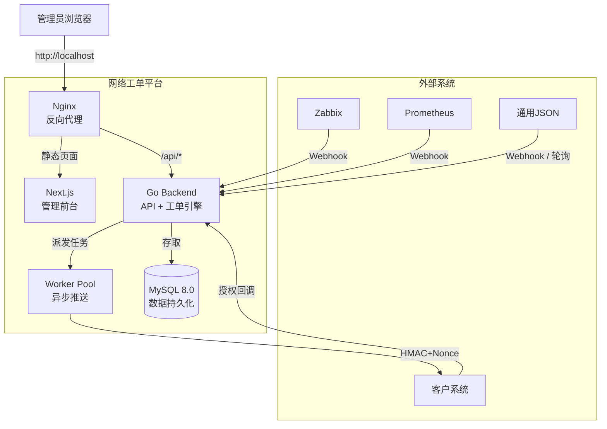

# 网络工单平台

> 告警自动流转为工单，推送客户系统，全程追踪直至闭环。

---

## 适用场景

| 场景 | 说明 |
|------|------|
| **运维告警 → 工单** | Zabbix / Prometheus 等监控系统触发告警后，自动生成工单并推送给客户 |
| **客户授权闭环** | 客户系统收到工单后，通过安全回调确认授权或拒绝，平台实时追踪状态 |
| **多客户分发** | 不同告警源可配置推送到不同的客户系统，实现分级/分客户处理 |
| **告警去重降噪** | 相同根源的重复告警自动合并到同一工单，避免工单泛滥 |

**典型工作流：**

```
监控系统告警 ──► 平台自动建单 ──► 推送客户系统 ──► 客户授权/拒绝
                                                    │
                                                    ▼
                                              平台状态追踪 ──► 工单闭环
```

---

## 系统架构



**核心组件说明：**

| 组件 | 职责 |
|------|------|
| **Nginx** | 统一入口，反向代理前端页面和后端 API |
| **管理前台 (Next.js)** | 工单管理、告警源配置、客户管理、审计日志 |
| **后端 (Go)** | 告警解析、工单状态机、客户推送、签名验证 |
| **Worker Pool** | 异步向客户系统推送工单，带指数退避重试 |
| **MySQL** | 持久化存储工单、客户、告警源、日志等数据 |

---

## 快速开始

### 环境要求

- [Docker](https://docs.docker.com/get-docker/) 20.10+
- [Docker Compose](https://docs.docker.com/compose/install/) v2+

### 一键部署

```bash
git clone <仓库地址>
cd network-ticket
./deploy.sh
```

脚本会自动完成：环境检查、生成配置、构建镜像、启动服务、健康检查。

部署完成后访问 http://localhost，使用默认管理员账号登录：

| 角色 | 用户名 | 密码 |
|------|--------|------|
| 管理员 | `admin` | `admin123` |

> ⚠️ **首次登录后请立即修改默认密码。**

### 日常管理

```bash
./manage.sh start      # 启动服务
./manage.sh stop       # 停止服务
./manage.sh restart    # 重启服务
./manage.sh reload     # 重新加载配置（修改 .env 后使用）
./manage.sh status     # 查看服务状态
./manage.sh logs       # 查看实时日志
./manage.sh backup     # 备份数据库
./manage.sh update     # 更新代码后重新构建
./manage.sh uninstall  # 完全卸载（含数据，谨慎使用）
```

### 首次配置

登录管理后台后，建议按以下顺序配置：

1. **修改管理员密码** — 右上角用户菜单 → 修改密码
2. **添加客户** — 「客户管理」→ 填写客户名称、推送地址、API Key、HMAC Secret
3. **添加告警源** — 「告警源管理」→ 选择类型（Zabbix / Prometheus / 通用），配置 Webhook 地址到监控系统

详细操作见 [使用指南](docs/usage.md)。

---

## 功能特性

- **多告警源接入** — 支持 Zabbix、Prometheus、通用 JSON，Webhook / 轮询两种模式
- **智能去重** — 基于 SHA-256 指纹的告警去重，可配置时间窗口
- **工单全生命周期追踪** — 从告警接收到客户授权再到闭环，7 节点工作流可视化
- **安全推送** — HMAC-SHA256 签名 + Nonce 防重放，确保客户对接安全
- **指数退避重试** — 推送失败自动重试，最多 5 次，避免瞬时故障导致丢单
- **审计日志** — 所有操作留痕，支持按时间/操作人筛选

---

## 文档导航

| 文档 | 面向读者 | 内容 |
|------|----------|------|
| [部署手册](docs/deployment.md) | 运维 / 用户 | 生产环境配置、HTTPS、备份、FAQ |
| [使用指南](docs/usage.md) | 管理员 / 操作员 | 告警源配置、客户对接、工单操作 |
| [API 文档](docs/api.md) | 对接开发者 | REST API 接口参考、签名算法 |
| [架构文档](docs/architecture.md) | 技术读者 | 模块设计、数据流、安全机制、扩展路线 |
| [开发者文档](docs/DEVELOPMENT.md) | 贡献者 | 技术栈、本地开发、项目结构、数据库迁移 |

---

## License

MIT
